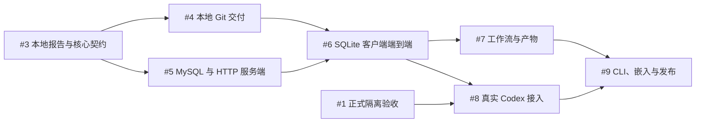

# 首版实施任务图

2026-10-07 完成独立交付工作区的边界决策与最小真实原型，再按可运行的行为切片拆分实现。主任务为 [Issue #2](https://github.com/Vamdawn/raven-zero/issues/2)；本轮只记录设计、原型与任务，尚未开始生产代码实现。

依据：[首版规格](v1-spec.md)、[技术栈](technology-stack.md)、[ADR 0020](../adr/0020-protected-delivery-workspace.md)和[交付隔离契约](delivery-workspace-isolation.md)。原型固定来源为 [`edbd170`](https://github.com/Vamdawn/raven-zero/tree/edbd170208dc19f306bcf8bbbcf0d461596a9021/prototypes/delivery_isolation)，不合并 Python/HTML 到生产代码。

| 任务 | 可验收的切片 | 阻塞依赖 |
| --- | --- | --- |
| [#1](https://github.com/Vamdawn/raven-zero/issues/1) | 正式外层写入边界、生产成果发布、macOS/Linux Codex 与停止确认验收 | 无；剩余验收仍开放 |
| [#3](https://github.com/Vamdawn/raven-zero/issues/3) | 核心契约和模拟 Agent：本地报告任务从初始化到本版检查与结果 | 无 |
| [#4](https://github.com/Vamdawn/raven-zero/issues/4) | 本地代码任务：Git 分支交付与提交身份恢复 | #3 |
| [#5](https://github.com/Vamdawn/raven-zero/issues/5) | MySQL 服务端：认证、任务领取、归属与幂等上报 | #3 |
| [#6](https://github.com/Vamdawn/raven-zero/issues/6) | SQLite 客户端：两类任务的 HTTP 端到端执行、补报与恢复 | #4、#5 |
| [#7](https://github.com/Vamdawn/raven-zero/issues/7) | 工作流依赖、文件产物、并发与失败传播 | #6 |
| [#8](https://github.com/Vamdawn/raven-zero/issues/8) | 真实 Codex：原生交互及受保护成果端到端验收 | #1、#6 |
| [#9](https://github.com/Vamdawn/raven-zero/issues/9) | 独立 CLI、嵌入示例与 macOS/Linux 发布验收 | #7、#8 |

下一项框架实现为 **#3**，先以模拟 Agent 加真实文件完成报告任务，验证成果版本与合法阶段；不要求为此先完成 MySQL、HTTP 或 Codex 生产适配器。#1 可以独立补齐，但在其关闭前不能把模拟隔离能力当成真实 Agent 的写入保证。

每个 Issue 写明行为、完成条件及阻塞关系；GitHub 原生子任务与依赖关系用于追踪，本文保留可读任务图。实现逐切片运行相关检查，真实 MySQL、SQLite、Git 和 Codex 不互相代替验收。初版复用个人 `CODEX_HOME`，迁移专用 Home 不加入首版实现图；自动测试仍使用隔离状态根。
